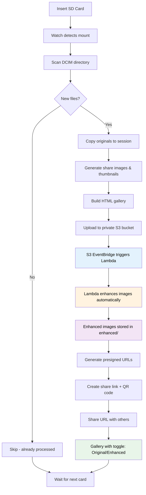

## GhostRoll

GhostRoll is a “drop the SD card in and it just works” ingest pipeline:

**SD card → local session → share-friendly JPEGs + thumbnails + gallery → private S3 → automatic enhancement (optional) → one share link**

It's designed to be:

- **Low-friction** (watch mode + one URL)
- **Incremental** (dedupe so re-inserting the same card is fast)
- **Privacy-friendly** (derived images strip metadata; S3 stays private)

```mermaid
flowchart LR
    A[📷 Insert SD Card] --> B[⏳ Automatic Processing]
    B --> C[🔗 Get Share Link]
    C --> D[📤 Share with Others]
    style A fill:#e1f5ff,color:#000
    style B fill:#fff4e1,color:#000
    style C fill:#e8f5e9,color:#000
    style D fill:#f3e5f5,color:#000
```



## How it works




## Quick start (macOS)

### Option 1: Automated setup (recommended)

```bash
./setup.sh
source .venv/bin/activate
ghostroll setup
```

The setup script will:
- Create a virtual environment
- Install GhostRoll and dependencies
- Guide you through configuration checks

### Option 2: Manual setup

#### 1) Install

```bash
python3 -m venv .venv
source .venv/bin/activate
pip install -U pip
pip install -e .
```

#### 2) Configure AWS (once)

GhostRoll uses the AWS CLI (`aws s3 cp` + `aws s3 presign`), so make sure this works:

```bash
aws configure
aws sts get-caller-identity
```

If you prefer to edit files directly, use the templates in:

- `docs/aws/credentials.example`
- `docs/aws/config.example`
- `docs/aws/iam-policy-ghostroll-s3.json` (starter least-privilege policy)

#### 3) Verify setup

Run the interactive setup guide to check everything is configured correctly:

```bash
ghostroll setup
```

This will check AWS credentials, disk space, mount points, and provide guidance for any issues.

#### 4) Name your SD card

Set the SD card volume label to:

- `auto-import`

macOS sometimes mounts as `auto-import 1`, etc — GhostRoll handles that.

#### 5) Run watch mode

```bash
ghostroll watch
```

When it finishes, you'll get a session directory under `~/ghostroll/` with a `share.txt` presigned URL.

## Troubleshooting

### Interactive setup guide

For a guided setup experience with helpful error messages:

```bash
ghostroll setup
```

### Doctor command

If something feels misconfigured (AWS creds, bucket perms, mount roots, disk space), run:

```bash
ghostroll doctor
```

## Continuous reliability

This repo includes:

- `ghostroll doctor` for quick environment checks
- a small CI smoke test (`tests/test_pipeline_smoke.py`) that runs on every push via GitHub Actions

## License

This project is licensed under the **PolyForm Noncommercial License 1.0.0** (non‑commercial use only). See `LICENSE`.

## What you get (per session)

Default location:

- `~/ghostroll/<SESSION_ID>/`

Contents:

- `originals/` (copied from the card; preserves structure)
- `derived/share/` (max 2048px long edge, quality ~90, auto-oriented, metadata stripped)
- `derived/thumbs/` (max 512px long edge, quality ~85, auto-oriented, metadata stripped)
- `index.html` (local gallery)
- `share.txt` (the link you share)
- `share-qr.png` (QR for the share link)
- `ghostroll.log` (session log)

The uploaded `index.html` is generated to work with a **private** bucket: it embeds presigned URLs for the images.
The gallery includes a responsive grid and a lightbox (click to open, Esc to close, ←/→ to navigate).
It also includes a **Download all** link for the session's share images.

### Enhanced Images (Optional)

GhostRoll can automatically enhance images with automatic lighting adjustments (similar to Lightroom's auto-settings). When enabled:

- Images are automatically enhanced after upload via AWS Lambda
- Enhanced versions are stored in `enhanced/` prefix
- Gallery includes a toggle button to switch between original and enhanced views
- User preference is saved in browser localStorage

See `aws-lambda/README.md` for deployment instructions.

## Dedupe / incremental behavior

GhostRoll keeps a persistent SQLite DB keyed by **SHA-256 of file bytes** (default `~/.ghostroll/ghostroll.db`).

- Re-insert same card with no new photos: it will quickly report “No new files detected”.
- Add new photos: only the new files are copied/processed/uploaded.

## Configuration

You can configure via env vars (CLI flags override env):

- `GHOSTROLL_SD_LABEL` (default `auto-import`)
- `GHOSTROLL_BASE_DIR` (default `~/ghostroll`)
- `GHOSTROLL_DB_PATH` (default `~/.ghostroll/ghostroll.db`)
- `GHOSTROLL_S3_BUCKET` (default `photo-ingest-project`)
- `GHOSTROLL_S3_PREFIX_ROOT` (default `sessions/`)
- `GHOSTROLL_PRESIGN_EXPIRY_SECONDS` (default `604800`)
- `GHOSTROLL_MOUNT_ROOTS` (default `/Volumes,/media,/run/media,/mnt`)
- `GHOSTROLL_STATUS_PATH` (default `~/ghostroll/status.json`)
- `GHOSTROLL_STATUS_IMAGE_PATH` (default `~/ghostroll/status.png`)
- `GHOSTROLL_STATUS_IMAGE_SIZE` (default `800x480`)
- `GHOSTROLL_PROCESS_WORKERS` (default: CPU-count clamped to 1–6)
- `GHOSTROLL_UPLOAD_WORKERS` (default `4`)
- `GHOSTROLL_PRESIGN_WORKERS` (default `8`)

Image settings:

- `GHOSTROLL_SHARE_MAX_LONG_EDGE` (default `2048`)
- `GHOSTROLL_SHARE_QUALITY` (default `90`)
- `GHOSTROLL_THUMB_MAX_LONG_EDGE` (default `512`)
- `GHOSTROLL_THUMB_QUALITY` (default `85`)

## Raspberry Pi / e‑ink

GhostRoll runs on Linux and writes status outputs that work well for e‑ink:

- `status.json` (machine-readable)
- `status.png` (monochrome "now doing X" image)


Components:
- Waveshare 2.13inch E-Ink Display HAT V4 Version Compatible with Raspberry Pi
- Raspberry Pi 4B
- SD card reader
- PiSugar battery


Raspberry Pi running this software and uploading images with a gallery link QR code on the e-ink screen.

If you want a "flash once, boot, and it runs" image with systemd + boot-partition config, follow:

- `pi/README.md`

Note: on Raspberry Pi OS Bookworm, system Python is “externally managed” (PEP 668), so manual installs typically use a **virtualenv**. See `pi/README.md` for the tested manual setup steps.

## Legacy shell prototype

The original prototype is still in `ingest.sh` (rsync + ImageMagick + rclone + aws presign).


