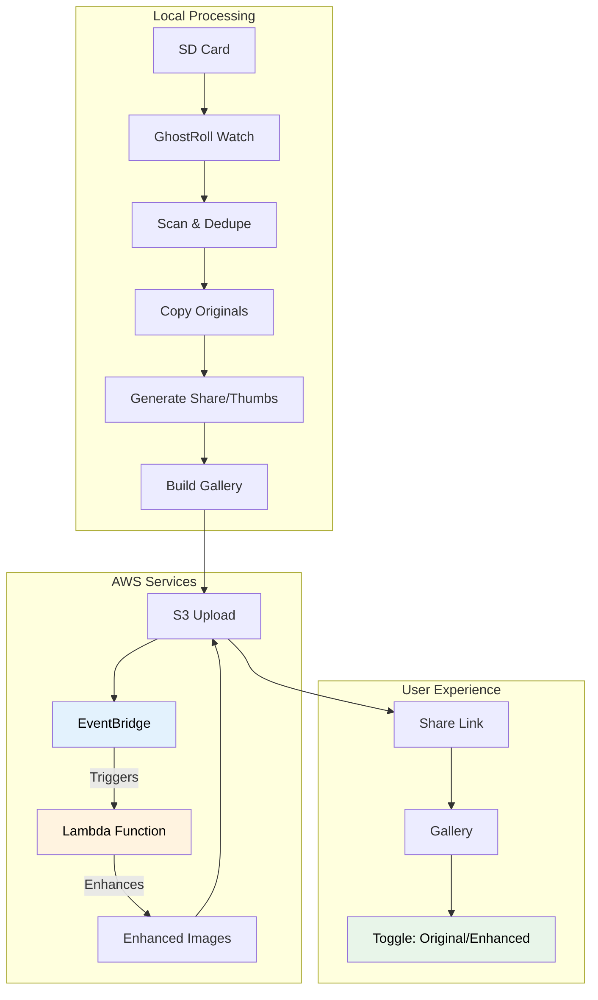

# GhostRoll Workflow Analysis

## Overview

**GhostRoll** is an automated photo ingestion pipeline that processes camera SD cards, generates shareable galleries, and uploads everything to private S3 storage. The core value proposition is: **"Drop the SD card in and it just works"** - producing a single shareable URL with minimal user interaction.

## High-Level Architecture

```
SD Card → Detection → Deduplication → Local Processing → S3 Upload → [Automatic Enhancement] → Share Link → Gallery with Toggle
```



### Key Components

1. **CLI Interface** (`ghostroll/cli.py`)
   - `watch`: Continuous monitoring mode (primary use case)
   - `run`: One-time processing mode (debugging/testing)
   - `setup`: Interactive configuration checker
   - `doctor`: Environment diagnostics

2. **Volume Detection** (`ghostroll/volume_watch.py`, `ghostroll/watchdog_watcher.py`)
   - Polls mount points (`/Volumes`, `/media`, `/run/media`, `/mnt`)
   - Optional real-time detection via Watchdog library
   - Validates DCIM directory presence

3. **Processing Pipeline** (`ghostroll/pipeline.py`)
   - Core orchestration of the entire workflow
   - Handles all stages from detection to share link generation

4. **Deduplication Database** (`ghostroll/db.py`)
   - SQLite-based persistent storage
   - SHA-256 hash-based file deduplication
   - Upload tracking for idempotency

5. **Image Processing** (`ghostroll/image_processing.py`)
   - Generates share-friendly JPEGs (max 2048px, quality 90)
   - Creates thumbnails (max 512px, quality 85)
   - Auto-orientation and metadata stripping

6. **Gallery Generation** (`ghostroll/gallery.py`)
   - Builds responsive HTML galleries
   - Supports both local (relative paths) and S3 (presigned URLs) versions

7. **AWS Integration** (`ghostroll/aws_cli.py`, `ghostroll/aws_boto3.py`)
   - Uses AWS CLI for S3 operations
   - Generates presigned URLs for private bucket access
   - Checks for enhanced image availability

8. **Image Enhancement (Optional)** (`aws-lambda/enhance-images/`)
   - AWS Lambda function for automatic lighting enhancements
   - Triggered by S3 EventBridge on image uploads
   - Applies automatic exposure, contrast, highlights, shadows adjustments
   - Cost-optimized with idempotency and early exits

9. **Status System** (`ghostroll/status.py`)
   - Machine-readable JSON status (`status.json`)
   - E-ink friendly PNG status images (`status.png`)
   - Includes battery monitoring (PiSugar integration)

## Complete Workflow

### Phase 0: Watch Loop (Idle State)

**Entry Point**: `ghostroll watch`

1. **Initialization**
   - Loads configuration (env vars or defaults)
   - Sets up logging and status writers
   - Initializes Watchdog watcher (if available) or falls back to polling

2. **Mount Detection**
   - Scans configured mount roots for volumes matching label (default: `auto-import`)
   - Validates volume has accessible `DCIM/` directory
   - Handles platform quirks (macOS may mount as `auto-import 1`, etc.)

3. **Idle State**
   - Writes status: `state=idle`, `step=watch`, message="Waiting for SD card…"
   - Polls every 2 seconds (configurable) or waits for Watchdog events
   - Continues until valid SD card detected

### Phase 1: Card Detection & Validation

1. **Volume Discovery**
   - Watchdog detects directory creation in mount roots, OR
   - Polling finds volume with matching label
   - Verifies volume is actually mounted (not just a directory)
   - Checks for `DCIM/` directory existence and accessibility

2. **Pre-Processing Checks**
   - Attempts to unmount any stale mounts
   - Validates volume is writable (can create test file)
   - Updates status: `state=running`, `step=detected`, message="SD card detected."

3. **Pipeline Invocation**
   - Calls `run_pipeline()` with detected volume path
   - Same codepath as `ghostroll run` command

### Phase 2: Scan & Deduplication

**Function**: `run_pipeline()` in `ghostroll/pipeline.py`

1. **DCIM Directory Validation**
   - Verifies `DCIM/` exists and is accessible
   - Handles mount point reconnection (triggers automount if needed)
   - Syncs filesystem to ensure fresh file listing

2. **Media File Discovery**
   - Recursively scans `DCIM/` using `find` command (bypasses Python caching)
   - Falls back to `os.walk()` if `find` fails
   - Filters files using `media.is_media()` (checks extensions)
   - Updates status: `state=running`, `step=scan`, message="Scanning DCIM for media…"

3. **File Pairing (RAW + JPEG)**
   - Groups files by `(parent_dir, stem)` to find RAW+JPEG pairs
   - Prefers JPEG for derivative generation when both exist
   - RAW files are still ingested but not processed into share images

4. **Deduplication (Global)**
   - **Pre-filtering**: Checks file sizes against database (fast rejection)
   - **Hashing**: Computes SHA-256 for all candidate files (parallelized, 4 workers)
   - **Database Check**: Batch queries database for existing hashes
   - **Crash Recovery**: Checks recent session `originals/` directories for already-copied files
   - **Result**: Separates files into "new" (to process) and "skipped" (already ingested)

5. **Early Exit**
   - If no new files found AND `always_create_session=False`: returns `None` (no-op)
   - Otherwise proceeds to session creation

### Phase 3: Session Creation & Early Publishing

1. **Session Directory Setup**
   - Generates session ID: `shoot-YYYY-MM-DD_HHMMSS_microseconds`
   - Creates directory structure:
     ```
     ~/ghostroll/<SESSION_ID>/
     ├── originals/DCIM/...
     ├── derived/share/...
     ├── derived/thumbs/...
     ├── index.html (local gallery)
     ├── share.txt (presigned URL)
     ├── share-qr.png (QR code)
     └── ghostroll.log (session log)
     ```

2. **Early Gallery Link Publishing**
   - Uploads `status.json` to S3 (indicates "uploading: true")
   - Generates presigned URL for status.json
   - Builds loading page HTML (`index.loading.s3.html`) that polls status.json
   - Uploads loading page to S3 as `index.html`
   - **Immediately generates presigned URL for gallery** (available before processing completes)
   - Writes URL to `share.txt`
   - Generates QR code PNG (`share-qr.png`)
   - Updates status with URL and QR path (so e-ink display shows it immediately)

**Key Design**: The share link is available **immediately** after session creation, before any files are processed. The gallery shows a loading state that auto-refreshes as images become available.

### Phase 4: Ingest Originals

1. **File Copying**
   - Copies all "new" files to `originals/DCIM/`, preserving directory structure
   - Parallelized copying (4 workers, configurable)
   - Handles device removal errors gracefully
   - Updates status: `state=running`, `step=ingest`, message="Copying originals…"

2. **Database Marking**
   - Batch inserts SHA-256 hashes into `ingested_files` table
   - Marks files as ingested for future deduplication
   - Commits transaction

3. **Crash Recovery**
   - If process crashes during copy, already-copied files are detected on next run
   - Files are marked as ingested to prevent re-hashing

### Phase 5: Image Processing

1. **Derivative Generation**
   - Processes only JPEG sources (RAW files skipped for derivatives)
   - Only processes files that are "new" (not already in database)
   - Updates status: `state=running`, `step=process`, message="Generating share images + thumbnails…"

2. **Share Images** (`derived/share/`)
   - Max long edge: 2048px (configurable)
   - Quality: 90 (configurable)
   - Auto-orientation based on EXIF
   - Metadata stripped

3. **Thumbnails** (`derived/thumbs/`)
   - Max long edge: 512px (configurable)
   - Quality: 85 (configurable)
   - Auto-orientation and metadata stripping

4. **EXIF Extraction**
   - Extracts capture timestamp for sorting
   - Extracts camera model for gallery labels
   - Used for gallery item metadata

5. **Parallelization**
   - Uses ThreadPoolExecutor (default: CPU count, clamped 1-6)
   - Progress updates every 0.75 seconds to status system

### Phase 6: Gallery & Zip Creation

1. **Share Zip**
   - Creates `share.zip` containing all files from `derived/share/`
   - Used for "Download all" functionality

2. **Local Gallery**
   - Builds `index.html` with relative paths (works offline)
   - Sorts items by capture timestamp (if available) or filename
   - Includes lightbox functionality (click to view, Esc to close, arrow keys to navigate)
   - Responsive grid layout

### Phase 7: S3 Upload (Idempotent)

1. **Upload Task Generation**
   - Creates upload tasks for:
     - All thumbnails (`thumbs/*`)
     - All share images (`share/*`)
     - `share.zip`
   - S3 prefix: `sessions/<SESSION_ID>/`

2. **Upload Deduplication**
   - Before uploading, checks `uploads` table for existing S3 key
   - If local file SHA matches recorded SHA: **skips upload** (idempotent)
   - Otherwise uploads and records SHA

3. **Parallel Upload**
   - Uses ThreadPoolExecutor (default: 4 workers, configurable)
   - Updates status with progress: `uploaded_done` / `uploaded_total`
   - Handles AWS errors gracefully with detailed messages

4. **Progressive Gallery Updates**
   - Every 30 seconds during upload, builds partial gallery with uploaded images
   - Presigns URLs for ready images
   - Uploads updated `index.html` to S3
   - Gallery becomes progressively more complete as uploads finish

5. **Error Handling**
   - Continues uploading other files if one fails
   - Reports success rate and detailed error messages
   - Provides actionable guidance (check AWS credentials, permissions, etc.)

### Phase 8: Presigned URL Generation

1. **Asset Presigning**
   - Generates presigned URLs for all thumbnails and share images
   - Parallelized (default: 8 workers, configurable)
   - Presigned URLs expire after configured time (default: 7 days)
   - Updates status: `state=running`, `step=presign`, message="Generating share link…"

2. **Download Zip Presigning**
   - Presigns URL for `share.zip`

### Phase 9: Final Gallery Upload

1. **S3 Gallery Construction**
   - Builds `index.s3.html` with all presigned URLs embedded
   - Checks for enhanced images availability (if Lambda is enabled)
   - Includes enhanced image URLs as data attributes when available
   - Sorts items by capture timestamp
   - Includes "Download all" link (presigned share.zip URL)
   - Gallery works with **private S3 bucket** (access via presigned URLs only)
   - If enhanced images exist, includes toggle button for switching views

2. **Final Upload**
   - Uploads `index.s3.html` to S3 as `index.html` (replaces loading page)
   - Updates `status.json` to `uploading: false` (triggers final refresh in browser)

3. **Completion**
   - Updates status: `state=done`, `step=done`, message="Complete. Remove SD card when ready."
   - Includes final counts (discovered, new, skipped, processed, uploaded)
   - QR code path included for e-ink display

### Phase 9.5: Automatic Image Enhancement (Optional, Asynchronous)

**Note**: This phase runs automatically in parallel after Phase 7 (S3 Upload), triggered by S3 EventBridge.

1. **S3 EventBridge Trigger**
   - When images are uploaded to `sessions/<SESSION_ID>/share/*.jpg`, S3 EventBridge automatically triggers Lambda function
   - EventBridge is configured at bucket level (one-time setup)

2. **Lambda Function Execution**
   - Function: `ghostroll-enhance-images`
   - Downloads share image from S3
   - Validates file is JPEG and in correct prefix
   - Checks if enhanced version already exists (idempotency)

3. **Image Enhancement**
   - Applies automatic lighting adjustments:
     - Auto exposure (histogram-based brightness adjustment)
     - Auto contrast (optimal black/white points)
     - Highlights adjustment (recover bright areas)
     - Shadows adjustment (lift dark areas)
     - Whites/Blacks adjustment (fine-tune endpoints)
   - Uses Pillow (PIL) and NumPy for processing
   - Maintains original image dimensions and quality settings

4. **Enhanced Image Upload**
   - Uploads enhanced version to `sessions/<SESSION_ID>/enhanced/<filename>.jpg`
   - Sets appropriate Content-Type and metadata
   - Includes idempotency check to prevent duplicate processing

5. **Cost Optimizations**
   - Early exit for non-JPEG files (saves compute)
   - Early exit for files not in `share/` prefix (filtering)
   - Idempotency check prevents re-processing (saves ~10% on duplicates)
   - Efficient error handling prevents wasted processing

6. **Gallery Integration**
   - Gallery automatically detects enhanced images when presigning URLs
   - Enhanced images included as data attributes in gallery HTML
   - Toggle button appears when enhanced versions are available
   - JavaScript handles switching between original/enhanced views
   - User preference saved in browser localStorage

### Phase 10: Gallery with Enhanced Images

1. **Enhanced Image Detection**
   - When gallery loads, checks for enhanced images in S3
   - Compares available share images with enhanced versions
   - Marks images with `data-enhanced` attribute when available

2. **Toggle Functionality**
   - Toggle button appears in gallery header when enhanced images exist
   - Button states: "✨ Enhanced" / "📷 Original"
   - Clicking toggles between views
   - Preference saved in browser localStorage

3. **Lightbox Integration**
   - Lightbox displays selected version (enhanced or original)
   - Navigation (arrow keys) maintains selected view
   - Smooth transitions between images

### Phase 11: Card Removal Detection

1. **Unmount Attempt**
   - After processing completes, attempts to unmount the volume
   - Uses platform-appropriate commands (`diskutil unmount` on macOS, `umount` on Linux)

2. **Removal Detection**
   - Polls to detect when card is removed
   - Checks if volume is still writable (definitive test)
   - Checks if different card was inserted
   - Waits until card is removed before returning to idle state

3. **Return to Watch Loop**
   - Resets last processed volume tracking
   - Returns to Phase 0 (idle state)
   - Ready for next card insertion

## Key Design Patterns

### 1. **Idempotency**
- **File-level**: SHA-256 hash deduplication prevents re-processing same files
- **Upload-level**: Per-S3-key deduplication prevents re-uploading same content
- **Crash recovery**: Detects already-copied files in recent sessions

### 2. **Progressive Enhancement**
- Share link available immediately (before processing)
- Gallery shows loading state initially
- Progressively updates as images upload
- Final gallery replaces loading page when complete

### 3. **Privacy-First**
- S3 bucket remains **private** (no public access)
- All access via **presigned URLs** (time-limited, revocable)
- Derived images strip metadata (EXIF removed)
- Original files never uploaded (only share-friendly derivatives)

### 4. **Platform Agnostic**
- Works on macOS and Linux
- Handles mount point differences (`/Volumes` vs `/media`)
- Platform-specific optimizations (Watchdog on Linux, `diskutil` on macOS)

### 5. **Error Resilience**
- Continues processing other files if one fails
- Detailed error messages with actionable guidance
- Graceful handling of device removal during processing
- Status system provides visibility into failures

### 6. **Performance Optimization**
- Parallel hashing (4 workers)
- Parallel copying (4 workers)
- Parallel image processing (CPU count, clamped 1-6)
- Parallel uploading (4 workers)
- Parallel presigning (8 workers)
- Size-based pre-filtering (avoids unnecessary hashing)

## Data Flow

```
SD Card (DCIM/)
    ↓
[Scan & Hash] → SQLite DB (dedupe check)
    ↓
[Copy Originals] → ~/ghostroll/<SESSION>/originals/
    ↓
[Process JPEGs] → ~/ghostroll/<SESSION>/derived/{share,thumbs}/
    ↓
[Build Gallery] → ~/ghostroll/<SESSION>/index.html
    ↓
[Upload to S3] → s3://bucket/sessions/<SESSION>/{share,thumbs,share.zip}
    ↓
[Presign URLs] → Presigned URLs for all assets
    ↓
[Upload Gallery] → s3://bucket/sessions/<SESSION>/index.html (with presigned URLs)
    ↓
[Generate Share Link] → Presigned URL for index.html → share.txt + share-qr.png
```

## Configuration Points

### Environment Variables
- `GHOSTROLL_SD_LABEL`: SD card volume label (default: `auto-import`)
- `GHOSTROLL_BASE_DIR`: Output directory (default: `~/ghostroll`)
- `GHOSTROLL_DB_PATH`: SQLite database path (default: `~/.ghostroll/ghostroll.db`)
- `GHOSTROLL_S3_BUCKET`: S3 bucket name (default: `photo-ingest-project`)
- `GHOSTROLL_S3_PREFIX_ROOT`: S3 prefix root (default: `sessions/`)
- `GHOSTROLL_PRESIGN_EXPIRY_SECONDS`: URL expiry (default: 604800 = 7 days)
- `GHOSTROLL_PROCESS_WORKERS`: Image processing parallelism (default: CPU count, clamped 1-6)
- `GHOSTROLL_UPLOAD_WORKERS`: Upload parallelism (default: 4)
- `GHOSTROLL_PRESIGN_WORKERS`: Presigning parallelism (default: 8)
- Image quality/size settings (share max edge, thumb max edge, quality levels)

## Status System

### JSON Status (`status.json`)
Machine-readable status with:
- `state`: `idle` | `running` | `error` | `done`
- `step`: Current pipeline step
- `message`: Human-readable message
- `session_id`: Current session ID
- `volume`: Mounted volume path
- `counts`: Progress counters (discovered, new, skipped, processed, uploaded, etc.)
- `url`: Presigned gallery URL
- `qr_path`: Path to QR code PNG
- `hostname`, `ip`: Network info (for SSH access)
- `battery_percentage`, `battery_charging`: Battery status (PiSugar)

### PNG Status (`status.png`)
E-ink friendly monochrome image showing:
- Current state and message
- Progress indicators (processing/upload counts)
- QR code (when available)
- Battery indicator (if PiSugar detected)
- SSH connection info (hostname/IP)

## Error Handling Strategy

1. **Validation Errors**: Clear messages with actionable guidance
   - Missing DCIM directory
   - Volume not accessible
   - AWS credentials issues

2. **Processing Errors**: Continue with other files
   - Corrupted image files: logged and skipped
   - Individual upload failures: logged, continue with others

3. **Critical Errors**: Stop pipeline, provide guidance
   - Device removed during copy: partial results saved
   - AWS connectivity issues: detailed error messages
   - Database corruption: guidance to check/repair DB

## Testing & Reliability

- **CI Smoke Test**: `tests/test_pipeline_smoke.py` runs on every push
- **Doctor Command**: `ghostroll doctor` checks environment configuration
- **Setup Command**: `ghostroll setup` provides interactive guidance
- **Logging**: Comprehensive logging at DEBUG/INFO/WARNING/ERROR levels
- **Session Logs**: Per-session log files in session directory

## Use Cases

### Primary: Automated Photo Ingestion
1. Photographer inserts SD card labeled `auto-import`
2. GhostRoll detects, processes, uploads
3. QR code appears on e-ink display
4. Photographer scans QR code to share gallery link
5. Recipients view gallery via presigned URLs
6. Photographer removes SD card when done

### Secondary: Manual Processing
- `ghostroll run /Volumes/auto-import`: Process specific volume once
- Useful for testing, debugging, or one-off processing

### Tertiary: Raspberry Pi Deployment
- Runs as systemd service
- E-ink display shows status and QR code
- Battery monitoring integration
- Headless operation

## Summary

GhostRoll is a **well-architected, production-ready** photo ingestion pipeline that emphasizes:
- **Simplicity**: "Just works" with minimal configuration
- **Reliability**: Idempotent operations, crash recovery, error resilience
- **Privacy**: Private S3 bucket with presigned URLs
- **Performance**: Parallel processing throughout
- **User Experience**: Immediate share link, progressive gallery updates, clear status feedback

The workflow is designed to handle real-world scenarios: device removal, network failures, corrupted files, and system crashes - all while providing clear feedback and maintaining data integrity.

