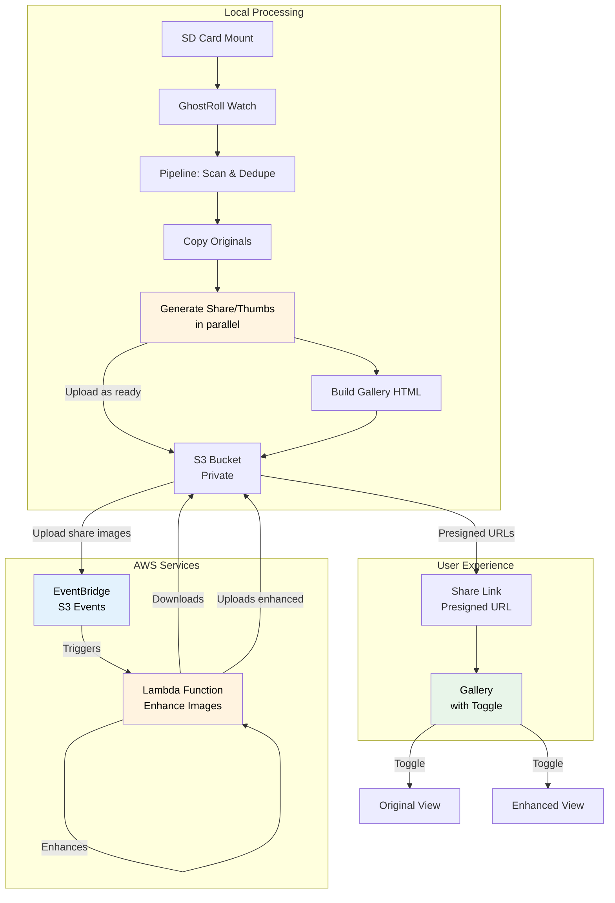
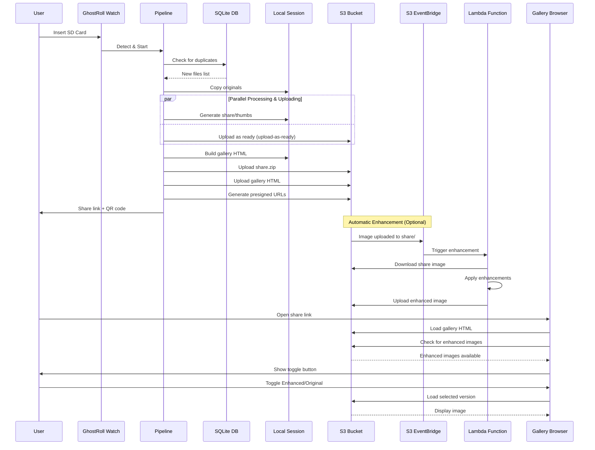

# GhostRoll — How it works (high level)

This document is intended as input to an LLM to generate a visual (architecture + sequence diagram).

## What GhostRoll does (one sentence)

**GhostRoll watches for a camera SD card mount, dedupes and copies new media into a local "session" folder, generates share-friendly JPEG derivatives + a static HTML gallery, uploads assets to a private S3 bucket, automatically enhances images via AWS Lambda (optional), then produces a single presigned share URL (and QR) for the session with a toggle to view original or enhanced images.**

## Primary components (diagram “boxes”)

- **User / Photographer**: inserts/removes SD card, shares the generated URL.
- **Mounted SD card volume**: must contain `DCIM/` and is typically labeled `auto-import` (macOS may mount as `auto-import 1`, etc).
- **GhostRoll CLI** (`ghostroll watch`, `ghostroll run`):
  - `watch`: loop waiting for a mounted volume with the target label + `DCIM/`
  - `run`: executes the ingest pipeline once for a specific mounted volume
- **Pipeline** (`ghostroll/pipeline.py::run_pipeline`): end-to-end ingestion + processing + upload + share-link creation.
- **Local sessions directory** (default `~/ghostroll/<SESSION_ID>/`): stores outputs for each run.
- **SQLite DB** (default `~/.ghostroll/ghostroll.db`):
  - `ingested_files`: global dedupe keyed by SHA-256 of file bytes
  - `uploads`: per-S3-key upload dedupe keyed by SHA-256 of the local file
- **Image processing**: generates share-size images and thumbnails (auto-orient, strip metadata).
- **AWS CLI / S3**:
  - Uploads session assets into a **private** bucket/prefix.
  - Generates **presigned URLs** so the bucket can remain private while links work.
- **AWS Lambda (optional, for enhanced images)**:
  - Automatically triggered by S3 EventBridge when images are uploaded to `share/` prefix.
  - Applies automatic lighting enhancements (exposure, contrast, highlights, shadows).
  - Uploads enhanced versions to `enhanced/` prefix.
  - Cost-optimized with idempotency checks and early exits.
- **Status outputs (optional, especially for Raspberry Pi / e-ink)**:
  - `status.json` (machine-readable)
  - `status.png` (simple display image showing current step/progress)

## Key data model: “Session”

Each successful run creates (or reuses) a **session id** like `shoot-YYYY-MM-DD_HHMMSS_microseconds`.

Typical session contents:

- `originals/` (copied from card; preserves DCIM structure)
- `derived/share/` (share-friendly JPEGs)
- `derived/thumbs/` (small thumbnails)
- `share.zip` (zip of share images for "download all")
- `index.html` (local gallery using relative paths)
- `index.s3.html` (temporary file used to upload an S3-friendly `index.html` embedding presigned URLs)
- `share.txt` (the final presigned URL to share)
- `share-qr.png` (QR code for the share link)
- `ghostroll.log` (session log)

S3 bucket structure (after upload and optional enhancement):

- `sessions/<SESSION_ID>/share/` (original share images)
- `sessions/<SESSION_ID>/enhanced/` (automatically enhanced versions, if Lambda is enabled)
- `sessions/<SESSION_ID>/thumbs/` (thumbnails)
- `sessions/<SESSION_ID>/index.html` (gallery with toggle for original/enhanced)
- `sessions/<SESSION_ID>/share.zip` (download all)

## End-to-end flow (sequence-diagram friendly)

### 0) Watch loop (steady state)

1. `ghostroll watch` polls common mount roots (e.g. `/Volumes`, `/media`, `/run/media`, `/mnt`) for a directory whose name matches the configured label (exact match or “label N” suffix) and contains `DCIM/`.
2. While idle, it writes status outputs: **state=idle**, **step=watch**, “Waiting for SD card…”.

### 1) Detect SD card and start a run

3. On detection, `watch` calls the same codepath as `ghostroll run` with that mounted volume path.

### 2) Scan + dedupe (global)

4. The pipeline recursively scans `DCIM/` for “media files”.
5. For each discovered file, it computes **SHA-256(file bytes)** and checks `ingested_files`:
   - If SHA exists: it is **skipped** (already seen in any past session).
   - If SHA is new: it becomes a **new file** for this run.
6. If there are **no new files**, the pipeline is a no-op and returns (unless configured to always create a session).

### 3) Ingest originals (copy to local session)

7. A new session directory is created under the base dir.
8. Each **new file** is copied into `originals/DCIM/<relative path under DCIM>`, preserving structure.
9. Each copied file’s SHA is inserted into `ingested_files` (dedupe record).

### 4) Process derivatives + upload in parallel (upload-as-ready)

10. From the discovered media set, the pipeline chooses sources for derivatives:
   - If RAW+JPEG exist with the same stem in the same folder, prefer the **JPEG** for derivatives.
   - RAW files are still ingested as originals but generally not used to generate share/thumb images.
11. **Parallel processing and uploading** starts:
    - Processing workers generate derivatives concurrently:
      - `derived/share/<same relpath>.jpg` (e.g. max long edge ~2048, quality ~90, auto-orient, metadata stripped)
      - `derived/thumbs/<same relpath>.jpg` (e.g. max long edge ~512, quality ~85, auto-orient, metadata stripped)
    - **As soon as each image is processed**, it's immediately queued for upload (upload-as-ready pattern)
    - Upload workers consume from the queue and upload to S3 in parallel with ongoing processing
    - This overlaps processing and upload work, reducing total time by **30-50% on Raspberry Pi**
12. Basic EXIF info is extracted (capture time/camera) to sort and label items in the gallery.
13. Upload dedupe: before uploading a given `s3_key`, the pipeline checks `uploads`:
    - If the recorded `local_sha256` matches the current local file hash, upload is **skipped**.
    - Otherwise upload happens and `uploads` is updated. (This makes reruns more idempotent.)

### 5) Build local gallery + zip

14. After all processing/uploads complete, build `share.zip` from `derived/share/` for a single "download all" artifact.
15. Upload `share.zip` to S3.
16. Build a **local** `index.html` that references `derived/thumbs/...` and `derived/share/...` via relative paths (works offline / locally).

### 6) Create an S3-shareable gallery (presigned URLs)

17. Compute an S3 prefix like `sessions/<SESSION_ID>/` (configurable root + session id).
18. Generate presigned URLs for:
   - every thumbnail object
   - every share image object
   - every enhanced image object (if available)
   - `share.zip`
19. Build `index.s3.html` that embeds those presigned URLs (so the bucket can remain private).
   - If enhanced images exist, includes toggle button and enhanced URLs as data attributes.
20. Upload `index.s3.html` to S3 as `.../index.html`.

### 7) Automatic image enhancement (optional, via AWS Lambda)

21. When images are uploaded to `sessions/<SESSION_ID>/share/*.jpg`, S3 EventBridge automatically triggers the Lambda function.
22. Lambda function:
   - Downloads the share image from S3.
   - Applies automatic lighting enhancements (exposure, contrast, highlights, shadows).
   - Uploads enhanced version to `sessions/<SESSION_ID>/enhanced/*.jpg`.
   - Includes idempotency check to prevent duplicate processing.
23. Enhancement happens asynchronously after upload; gallery detects and uses enhanced images when available.

### 8) Produce the final share link + QR

24. Generate a presigned URL for the uploaded `.../index.html`.
25. Write it to `share.txt` and optionally render:
   - `share-qr.png`
   - an ASCII QR in logs
26. Write status outputs: **state=done**, **step=done**, including counts and the final URL.
27. `watch` then waits for SD card removal before returning to idle.

### 9) Gallery with enhanced images

28. When users open the gallery:
   - Gallery automatically detects if enhanced images are available.
   - If enhanced images exist, a toggle button appears: "✨ Enhanced" / "📷 Original".
   - Users can switch between views; preference is saved in browser localStorage.
   - Lightbox displays the selected version (enhanced or original).

## External dependencies / integrations (for the diagram)

- **AWS CLI** is used for:
  - `s3 cp` uploads
  - `s3 presign` URL generation
- **AWS Lambda** (optional, for enhanced images):
  - Automatically triggered by S3 EventBridge on image uploads
  - Processes images with automatic lighting enhancements
  - Uses Pillow (PIL) and NumPy for image processing
  - Cost-optimized with idempotency and early exits
- **S3 bucket is private**; access is via **presigned URLs** embedded into the generated gallery page.
- **S3 EventBridge** (optional):
  - Enables automatic Lambda triggers on S3 object creation
  - Filters for `sessions/*/share/*.jpg` uploads
- **SQLite** provides:
  - cross-session file dedupe (by file-content hash)
  - upload idempotency per S3 key (by local file hash)

## Architecture Diagram

## Sequence Diagram

## Suggested visuals to request from ChatGPT

- **Architecture diagram (boxes + arrows)**:
  - SD Card Mount → GhostRoll Watch/Run → Local Session Folder + SQLite DB → AWS CLI → S3 (private) → S3 EventBridge → Lambda Function → Enhanced Images → Presigned URL → Viewer Browser (with toggle)
- **Sequence diagram (swimlanes)**:
  - Lanes: User, OS Mount, GhostRoll Watch, Pipeline, SQLite, Local FS, AWS CLI, S3, EventBridge, Lambda, Gallery Browser
  - Steps: detect → scan/hash → copy originals → process → build gallery → upload → EventBridge trigger → Lambda enhance → upload enhanced → presign → upload index → presign index → write share.txt/QR → gallery with toggle

